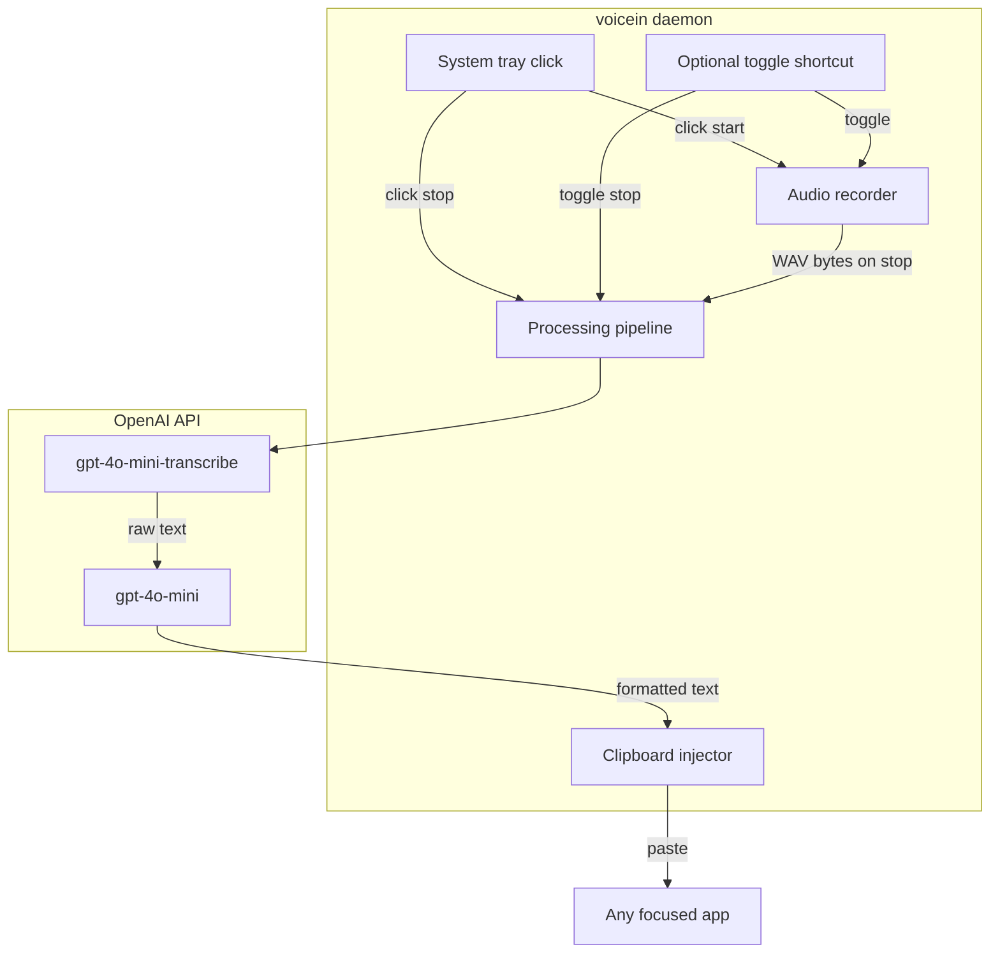

# VoiceIn — MVP Implementation Plan

## Goal

Personal dictation tool for **Ubuntu 24.04+ GNOME on X11**: toggle recording from the system tray (or optional shortcut), cloud transcription, LLM polish (newlines, punctuation, spoken formatting commands), minimal UI. Designed for **long dictation sessions** (20–60+ seconds) without holding any key.

## Confirmed decisions

| Decision | Choice |
|----------|--------|
| STT | OpenAI `gpt-4o-mini-transcribe` (~$0.003/min) |
| LLM | OpenAI `gpt-4o-mini` (same API key, same SDK) |
| Desktop | Ubuntu 24.04+ GNOME **X11** |
| Text injection v1 | Clipboard + `Ctrl+V` (via `xdotool`) |
| UI | System tray icon — **primary control** (click to start/stop) |
| Interaction | **Toggle**: click tray icon to start recording, click again to stop and process |
| Optional shortcut | Configurable global key (e.g. `Super+Shift+V`) — same toggle behavior |
| LLM rewrite control | **`rewrite_level` 0–10** (default **0** = format only, no content rewriting) |
| Primary use case bias | AI prompting — light structural polish when rewrite level > 0 |

**Upgrade path (post-MVP):** swap STT adapter to AssemblyAI Universal-3 Pro if jargon/accuracy needs improve; add direct keystroke injection if clipboard becomes annoying.

---

## Architecture



**Recording flow (toggle mode):**
1. **Start** — user clicks tray icon (or presses optional shortcut) while idle → mic capture begins, tray icon switches to "recording" state (red dot / pulsing mic).
2. **Stop** — user clicks tray icon again (or same shortcut) → capture stops, audio encoded as WAV (16 kHz mono PCM).
3. **Process** — tray icon switches to "processing" state while pipeline runs:
   - POST audio to OpenAI transcription endpoint.
   - POST raw transcript to chat completions with fixed system prompt.
   - Save clipboard backup, copy formatted text, send `Ctrl+V` to focused window, restore clipboard.
4. **Done** — tray icon returns to idle.

**Long sessions:** OpenAI accepts files up to 25 MB (~80 min at 16 kHz mono). A 60 s clip is ~2 MB — well within limits. No chunking needed for MVP. Optional `max_duration_secs = 300` config guard to prevent runaway recordings.

Typical latency budget after stop: 3–6 s for a 30 s utterance, 5–10 s for a 60 s utterance (STT scales with audio length; user is not holding anything during this wait).

---

## Project structure

Fresh repo at [`/home/yatnam/projects/voicein`](/home/yatnam/projects/voicein):

```
voicein/
├── install.sh
├── pyproject.toml
├── README.md
├── config.example.toml
├── .env.example
├── .gitignore
├── systemd/voicein.service
└── voicein/
    ├── __main__.py          # CLI entry: voicein run
    ├── config.py            # Load ~/.config/voicein/config.toml + .env
    ├── daemon.py            # Main event loop
    ├── tray.py              # pystray system tray
    ├── hotkey.py            # pynput global listener (X11)
    ├── audio/recorder.py    # sounddevice capture → WAV
    ├── pipeline.py          # STT → LLM orchestration
    ├── stt/openai.py        # gpt-4o-mini-transcribe adapter
    ├── llm/openai.py        # gpt-4o-mini formatter
    └── inject/clipboard.py  # wl-clipboard/xclip + xdotool paste
```

Adapter pattern in `stt/` and `llm/` keeps AssemblyAI/Claude swaps to one file each later.

---

## Key implementation details

### 1. Recording control — tray click (primary)

**System tray is the main UI.** Left-click the tray icon toggles recording:

- **Idle → click** → start recording (icon turns red / "Recording…").
- **Recording → click** → stop, run pipeline, paste result (icon shows "Processing…" then idle).

Implementation via **`pystray`**: set the "Toggle Recording" menu item as `default=True` so **left-click** on the icon triggers it directly (standard pystray pattern on Linux). Right-click still opens full menu (Quit, Cancel, Open config, Toggle LLM).

Tray menu also includes **Cancel Recording** (discard audio without processing) for mistakes mid-session.

### 2. Optional global shortcut (secondary)

Use **`pynput`** on X11 with a configurable combo (default: **`Super+Shift+V`**, disabled if empty in config):

- Each press **toggles** the same start/stop state as tray click (not hold-to-talk).
- `Escape` while recording → cancel via same path as tray "Cancel".

Shortcut is optional convenience — tray click alone is sufficient for MVP.

### 3. Audio capture

- Library: **`sounddevice`** + **`numpy`**, output via **`scipy.io.wavfile`** or stdlib `wave`.
- Format: 16 kHz, mono, 16-bit PCM.
- Device selection via config (`input_device` index or name); `install.sh` prints available devices for one-time setup.

### 4. OpenAI STT adapter

```python
# Pseudocode — voicein/stt/openai.py
client.audio.transcriptions.create(
    model="gpt-4o-mini-transcribe",
    file=audio_file,
    language="en",          # configurable
    response_format="text",
)
```

### 5. LLM prompt design and rewrite control

The LLM step is **not** open-ended chat — it receives raw STT output and returns **only** the text to paste. Behavior is controlled by **`rewrite_level`** (integer **0–10**, default **0**).

#### Config knob: `rewrite_level`

| Level | Name | What it does |
|-------|------|--------------|
| **0** (default) | Format only | Remove fillers, fix transcription glitches, apply spoken formatting commands, basic punctuation/capitalization. **No paraphrasing, no reordering, no added content.** |
| **1–3** | Light cleanup | Same as 0, plus fix obvious grammar and awkward phrasing. Minimal word changes only when STT clearly misheard or produced broken English. |
| **4–6** | Prompt polish | Moderate clarity improvements. For AI-style prompts: add logical structure (paragraph breaks, bullet lists when the speaker enumerated points), tighten vague wording **using only what was said**. |
| **7–10** | Active rewrite | Stronger prompt optimization — clearer role/instruction separation, better flow — but **must not invent requirements, examples, or constraints** the user didn't state. Higher = more aggressive polish within that guardrail. |

Set in config (`rewrite_level = 0`) or adjusted live from tray menu (cycle presets: 0 / 3 / 6 / 9). Tooltip shows current level: `Ready (rewrite: 0)`.

When `rewrite_level = 0`, temperature stays **0** and the prompt explicitly forbids any synonym swaps or sentence restructuring.

#### Prompt structure (sent to OpenAI)

Two messages — **system** (rules + level) and **user** (raw transcript):

```
┌─ SYSTEM MESSAGE ─────────────────────────────────────────────┐
│ 1. ROLE                                                       │
│    "You format voice dictation output. Return ONLY the final  │
│     text to insert — no quotes, labels, or explanation."      │
│                                                               │
│ 2. ALWAYS (every rewrite_level)                               │
│    • Remove filler words (um, uh, like, you know) silently    │
│    • Fix obvious STT errors only when meaning is clear        │
│    • Interpret spoken formatting commands as layout, NOT      │
│      literal words:                                           │
│        "new line" / "line break"     → newline                │
│        "new paragraph"               → blank line             │
│        "bullet point" / "dash"       → "- " prefix            │
│        spoken "period/comma/colon"   → punctuation            │
│    • Preserve the speaker's intent and vocabulary             │
│    • Plain text output (no markdown unless user asked)        │
│                                                               │
│ 3. REWRITE LEVEL: {rewrite_level} / 10                        │
│    [Injected tier block — see table above]                    │
│    At 0: "Do NOT rephrase, reorder, or improve wording.      │
│           Formatting and filler removal only."                │
│                                                               │
│ 4. USE-CASE BIAS: AI prompting (when level ≥ 1)               │
│    If the dictation reads like an LLM prompt/instruction:     │
│    • Prefer clear structure: context → task → constraints       │
│    • Turn spoken lists into bullets when the speaker listed     │
│      items ("first…, second…, also…")                          │
│    • Keep tone directive (imperative) unless user spoke casual  │
│    • Do NOT add system-prompt boilerplate the user didn't say   │
│    At level 0 this section is omitted entirely.               │
│                                                               │
│ 5. HARD LIMITS (all levels)                                   │
│    • Never add facts, steps, examples, or requirements         │
│    • Never answer the prompt — only format/rewrite the dictation│
│    • If unsure, prefer the verbatim transcript over guessing  │
└───────────────────────────────────────────────────────────────┘

┌─ USER MESSAGE ───────────────────────────────────────────────┐
│ {raw_stt_transcript}                                          │
└───────────────────────────────────────────────────────────────┘
```

#### Example behavior (same raw STT input)

**Raw STT:** `"um okay so I want you to act as a code reviewer and um new paragraph check for security issues bullet point SQL injection bullet point XSS new paragraph keep it concise"`

| rewrite_level | Output (approximate) |
|---------------|----------------------|
| **0** | `I want you to act as a code reviewer\n\ncheck for security issues\n- SQL injection\n- XSS\n\nkeep it concise` |
| **5** | `Act as a code reviewer.\n\nCheck for security issues:\n- SQL injection\n- XSS\n\nKeep the review concise.` |
| **9** | `You are a code reviewer. Analyze the code for security vulnerabilities, focusing on:\n- SQL injection\n- XSS\n\nProvide a concise review.` |

Level 9 improves flow but still only uses concepts the speaker stated — no added "OWASP" or "rate limiting" unless spoken.

#### Implementation notes

- Prompt builder lives in [`voicein/llm/openai.py`](/home/yatnam/projects/voicein/voicein/llm/openai.py) as `build_messages(transcript, rewrite_level)`.
- Model: `gpt-4o-mini`, `temperature=0` ( bump to `0.2` only when `rewrite_level >= 7` for slightly more natural rephrasing).
- Max output tokens scales with input length (~2× transcript word count, cap 2000 for long sessions).
- Set `llm.enabled = false` in config to skip LLM entirely and paste raw STT.

### 6. Text injection (clipboard)

[`voicein/inject/clipboard.py`](/home/yatnam/projects/voicein/voicein/inject/clipboard.py):

1. Backup current clipboard (`xclip -selection clipboard -o`).
2. Copy formatted text to clipboard.
3. `xdotool key ctrl+v` (X11 — works on your setup).
4. Restore original clipboard after ~200 ms delay.

User confirmed clipboard overwrite is acceptable for v1.

### 7. Config and secrets

**`~/.config/voicein/config.toml`** (from `config.example.toml`):

```toml
[hotkey]
# Optional toggle shortcut; leave empty to use tray click only
shortcut = "Super+Shift+V"

[audio]
sample_rate = 16000
input_device = ""       # empty = system default
max_duration_secs = 300 # safety cap (5 min); 0 = unlimited

[stt]
provider = "openai"
model = "gpt-4o-mini-transcribe"
language = "en"

[llm]
provider = "openai"
model = "gpt-4o-mini"
enabled = true          # set false to skip LLM and paste raw STT
rewrite_level = 0       # 0 = format only; 1-10 = increasing content polish (see plan)

[inject]
method = "clipboard"
```

**`~/.config/voicein/.env`:**

```
OPENAI_API_KEY=sk-...
```

Never commit `.env`; ship `.env.example` only.

### 8. System tray (minimal UI)

- **`pystray`** + **`PIL`** for icon states: **idle** (grey mic), **recording** (red mic), **processing** (spinner/grey).
- **Left-click icon** = toggle recording (default menu action).
- Right-click menu: Toggle Recording, Cancel Recording, **Rewrite level** (submenu: 0 / 3 / 6 / 9), Toggle LLM on/off, Open config folder, Quit.
- Tooltip shows current state: "Ready (rewrite: 0)", "Recording (0:42)", "Processing…".
- No main window.

### 9. Install and autostart

**[`install.sh`](/home/yatnam/projects/voicein/install.sh)** will:

1. Install system deps: `python3`, `python3-venv`, `portaudio19-dev`, `xdotool`, `xclip`.
2. Create venv, `pip install` project.
3. Copy example config to `~/.config/voicein/` if missing.
4. Install and enable **systemd user service** (`systemd/voicein.service`):
   - `ExecStart=/home/yatnam/projects/voicein/.venv/bin/voicein run`
   - `Restart=on-failure`

One-liner after clone: `./install.sh && systemctl --user enable --now voicein`

---

## Dependencies (`pyproject.toml`)

| Package | Purpose |
|---------|---------|
| `openai` | STT + LLM (single SDK) |
| `pynput` | Global hotkey on X11 |
| `sounddevice` | Mic capture |
| `numpy` | Audio buffer |
| `pystray`, `Pillow` | System tray |
| `tomli` / `tomllib` | Config parsing |
| `python-dotenv` | Load `.env` |

---

## Error handling (v1 essentials)

- No mic permission / no device → tray notification or stderr log.
- API key missing → fail at startup with clear message pointing to `~/.config/voicein/.env`.
- API timeout/error → log error, tray tooltip "Transcription failed", return to idle (do not paste garbage).
- Empty recording (< 0.5 s) → silently discard, return to idle.
- Max duration reached → auto-stop and process (tray tooltip warns at 4:30 if cap is 5 min).
- Second click while processing → ignored (prevent double-submit).

---

## Testing checklist

1. `./install.sh` on fresh Ubuntu 24.04 X11 — completes without errors.
2. Click tray icon → speak for ~30 s → click again → formatted text pasted in focused browser field.
3. 60 s dictation session — verify full transcript arrives, no truncation.
4. Say "hello world new paragraph this is line two" → verify paragraph break at **rewrite_level 0**.
5. Same utterance at **rewrite_level 6** → verify light polish without invented content.
6. Dictate an AI prompt with enumerated points → at level 6, verify bullet structure; at level 0, verify only formatting applied.
7. Start recording → Cancel from tray menu → nothing pasted.
7. Optional: `Super+Shift+V` toggles same as tray click.
8. Tray submenu: change rewrite level → next dictation uses new level.
9. Kill API key → daemon logs clear error, stays running.
10. `systemctl --user restart voicein` → tray toggle works after reboot simulation.

---

## Out of scope for MVP

- Wayland support (portal hotkeys, ydotool) — add when you switch sessions.
- Streaming / partial results while speaking.
- AssemblyAI promptable STT.
- Local/offline models.
- `.deb` / AppImage packaging.
- Transcript history UI.

---

## Estimated cost (personal use)

~100 dictation sessions/day × ~15 s avg ≈ 25 min/day → **~$0.075/day STT** + negligible LLM tokens. Well under $5/month.
